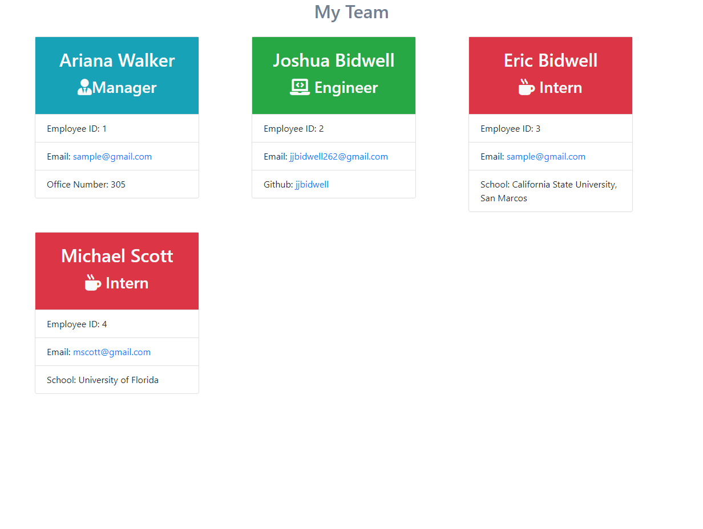

# Employee Engine

# Description
This is a command-line driven app that takes user input and and gives the user a formatted HTML file that displays the team members given by the user, as well as the position, employee id, and email of the user. Engineers also have a github link, managers have an office number, and interns have a school.  

The constructors come from their own files in the "lib" directory. The constructors are written using the class format for constructors, which allowed me to make the distinct classes, managers, engineers, and interns.

The app uses the node packages jest for testing and inquirer to take user input. 

Jest was used to write and test the constructor classes used for the app. I used the tests on the class repo in the final version of the app, and added some of my own tests to throw errors in case any input is left blank. All tests I ran passed by the end of the app development cycle. 

The final HTML page has some custom styling and bootstrap to make the page clean and presentable. 

Unfortunately, there are a few places I felt the app came up short. In rendering the final page, I noticed sometimes the items were not all rendered, leading me to try using promises in the last loop function. Unfortunately, I couldn't get that to work, and the due time was getting close, so I decided to use a timeout instead. While it does ensure all employees end up on the final page, they are often out of order. 

# Links 
GitHub repo: https://github.com/jjbidwell/employee-engine  

Video demo: https://drive.google.com/file/d/1TEANe0I12F7lMETWcS5eiqISzQX9F9q3/view

# Screenshots

;

